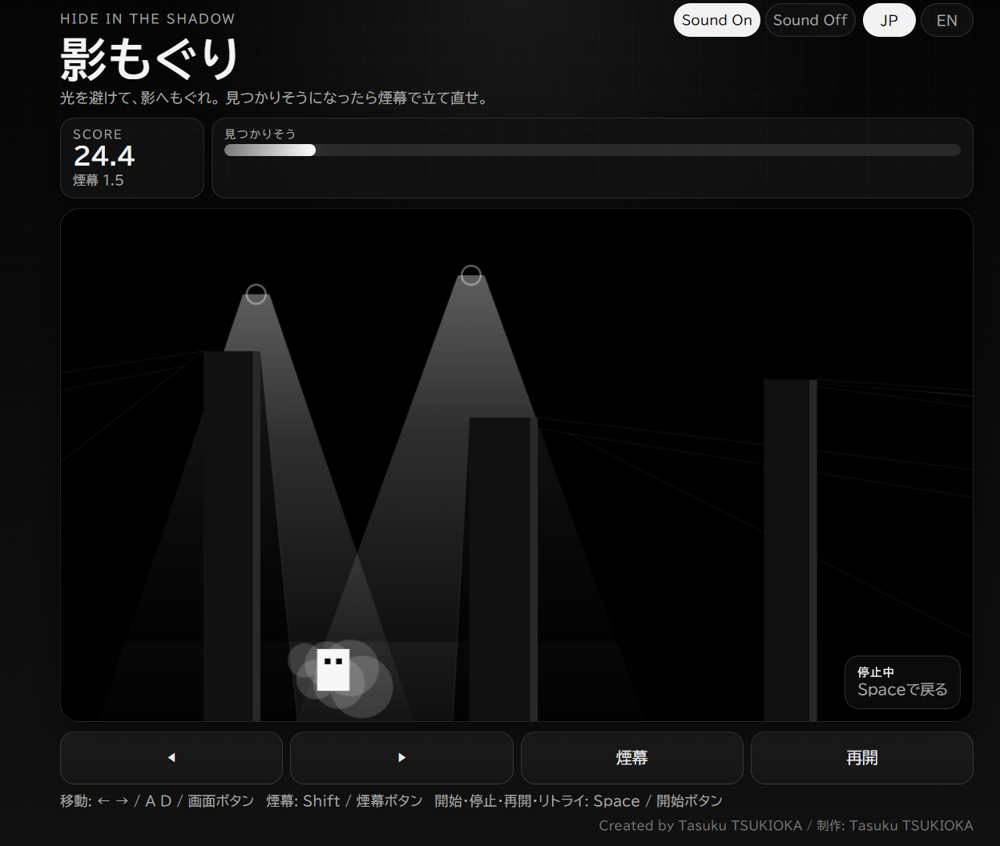

# 影もぐり / Kagemoguri

迫るサーチライトを避けながら、影へもぐれ。  
見つかりそうになったら煙幕で切り抜けろ。

Stay in the shadows while avoiding the sweeping searchlights.  
If you're about to be spotted, use a smoke screen to make your escape.

## Play / プレイ

https://tasukutsukioka.github.io/kagemoguri/

## Play Screen / プレイ画面

## Controls / 操作

- Move / 移動: `←` `→` / `A` `D` / on-screen buttons
- Smoke Screen / 煙幕: `Shift` / smoke button
- Start / Pause / Resume / Retry / 開始・一時停止・再開・リトライ: `Space` / start button

## Language / 言語

- Japanese / 日本語
- English / 英語

## Tech / 技術

- HTML
- CSS
- JavaScript

## Credits / クレジット

- Game, design, implementation / ゲーム制作・デザイン・実装: Tasuku TSUKIOKA
- Development assistance / 開発補助: OpenAI Codex
- BGM: generated with Google Gemini
- Sound effects / 効果音: generated with ElevenLabs (`elevenlabs.io`)
## Version / バージョン

Versioning uses `major.minor.patch`.

- Major: breaking changes / 大きな変更
- Minor: new features and adjustments / 機能追加・調整
- Patch: small fixes / 軽微な修正

- Version 1.1.0: ゲームバランスを調整 / Game balance updated
- Version 1.0.0: 公開 / Initial release
